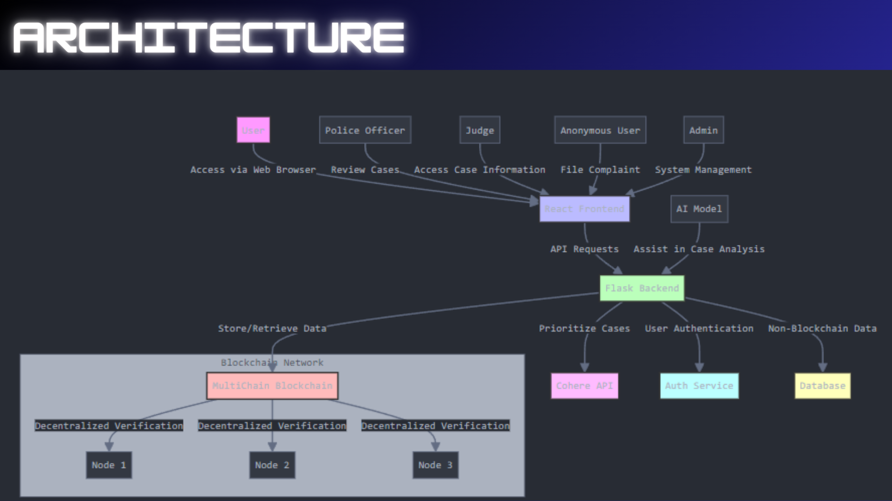

# blockthecrime - A Web3 Solution for Secure, Transparent Crime Reporting and Investigation
## Youtube Demo: https://youtu.be/kP5CB8qT1fA?si=yz5Sp-3-QrAIpPtB

- Two-Sided Platform for Reporting and Investigation: Victims can file complaints anonymously, add multiple pieces of evidence, and store all information securely on a private blockchain (Multichain).
- Investigators can review, flag, and prioritize cases based on severity and evidence.
- Investigators can sort cases by date, status, and severity, ensuring that critical complaints are prioritized for timely resolution.
- Each complaint includes a private, encrypted chatroom to facilitate secure discussions between victims and investigators.
- Tech stack: React, Tailwind CSS, Flask, Multichain, Cohere API.
